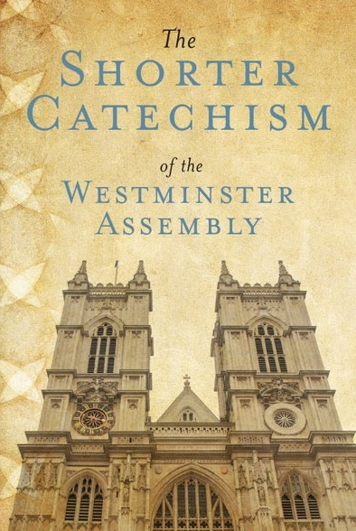

# 西敏小要理问答
《西敏小要理问答》是一本极为精简的基督教信仰宣言。

### 简要介绍

十七世纪在伦敦“西敏会议”所制订的〈西敏小要理问答〉，目的是要教育信徒全家，学习救恩要道。儿童从小学习其精简扼要的内容，背诵遵行、一生受益，在基督教英文世界中家喻户晓，极受欢迎。是一本极为精简的基督教信仰宣言。在107个问答中，已概括了有关上帝的全面真理，读者一旦记住了，就永远不会忘记。

求主恩待华人教会，全面使用《小要理问答》，无论家庭团契、查经小组、长执训练等，皆竞相研读背诵；信徒（无论小羊或老羊）人手一册，反覆温习。若能进一步查考其“经文根据”，则更能“恩上加恩，力上加力，乐上加乐，荣上加荣。”如此，才有可能落实“在至圣的真道上造就自己，为从前一次交付圣徒的真道竭力争辩”。

### 版权声明

改革宗出版社

本网站用于非商业性用途

奉献支持

有疑问请联系:solomonqins@outlook.com
